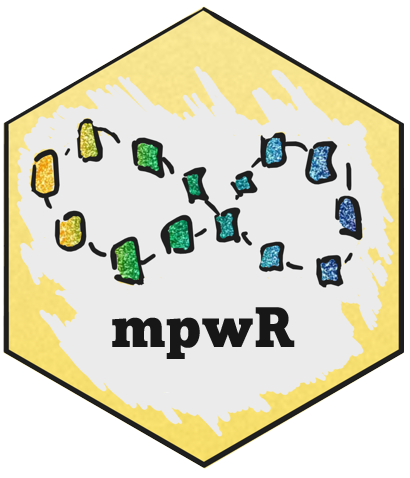

<!-- README.md is generated from README.Rmd. Please edit that file -->

```{r, include = FALSE}
knitr::opts_chunk$set(
  collapse = TRUE,
  comment = "#>",
  fig.path = "man/figures/README-",
  out.width = "80%"
)
```

# mpwR 

<!-- badges: start -->
[](https://github.com/OKdll/mpwR/actions)
[](https://CRAN.R-project.org/package=mpwR)
<!-- badges: end -->

mpwR [ɪmˈpaʊə(r)] offers a systematic approach for comparing proteomic workflows and empowers the researcher to effortlessly access valuable information about identifications, data completeness, quantitative precision, and other performance indicators across an unlimited number of analyses and multiple software tools. It can be used to analyze label-free mass spectrometry-based experiments with data-dependent or data-independent spectral acquisition.

## Applications - RMarkdown or Shiny
The functions of mpwR provide a great foundation to generate customized reports e.g. with RMarkdown or to build shiny apps/dashboards for downstream data analysis. An example for a shiny dashboard is also available - you can access the dashboard [here](https://okdll.shinyapps.io/mpwR/). 

## Installation

Install the development version from [GitHub](https://github.com/OKdll/mpwR) using the [`devtools`](https://github.com/r-lib/devtools) package by using the following commands:

```{r, eval = FALSE}
# install.packages("devtools") #remove "#" if you do not have devtools package installed yet
devtools::install_github("OKdll/mpwR", dependencies = TRUE) # use dependencies TRUE to install all required packages for mpwR
```

## Preparation

### Requirements 
As input the standard outputs of ProteomeDiscoverer, Spectronaut, DIA-NN or MaxQuant are supported by mpwR. Details about further requirements are listed in the vignette [Requirements](https://okdll.github.io/mpwR/articles/Requirements.html).

### Import 
Importing the output files from each software can be easily performed with `prepare_mpwR`. Further details about importing data are highlighted in the vignette [Import](https://okdll.github.io/mpwR/articles/Import.html).

```{r import, eval = FALSE}
files <- prepare_mpwR(path = "Path_to_Folder_with_files")
```

### Load packages
```{r libraries, message=FALSE, warning=FALSE}
library(mpwR)
library(flowTraceR)
library(magrittr) 
library(dplyr)
library(tidyr)
library(stringr)
library(tibble)
library(ggplot2)
```

## Example - Workflow

This is a basic example which shows the downstream analysis for number of identifications and data completeness. Please check the vignette [Workflow](https://okdll.github.io/mpwR/articles/Workflow.html) for a detailed analysis pipeline and more functionalities.

```{r example}
#get example
files <- create_example()
```

# Number of Identifications

## Report
The number of identifications can be determined with `get_ID_Report`. 
```{r ID-Report}
ID_Reports <- get_ID_Report(input_list = files)
```
<p>&nbsp;</p>
For each analysis an ID Report is generated and stored in a list. Each ID Report entry can be easily accessed:
```{r show-ID-Report}
ID_Reports[["DIA-NN"]]
```
<p>&nbsp;</p>
## Plot

### Individual
Each ID Report can be plotted with `plot_ID_barplot` from precursor- to proteingroup-level. The generated barplots are stored in a list.
```{r plot-ID-barplot}
ID_Barplots <- plot_ID_barplot(input_list = ID_Reports, level = "ProteinGroup.IDs")
```
<p>&nbsp;</p>
The individual barplots can be easily accessed:
```{r show-ID-barplot}
ID_Barplots[["DIA-NN"]]
```
<p>&nbsp;</p>
### Summary
As a visual summary a boxplot can be generated with `plot_ID_boxplot`.
```{r plot-ID-boxplot}
plot_ID_boxplot(input_list = ID_Reports, level = "ProteinGroup.IDs")
```
<p>&nbsp;</p>
# Data Completeness

## Report
Data Completeness can be determined with `get_DC_Report` for absolute numbers or in percentage. 

```{r DC-Report}
DC_Reports <- get_DC_Report(input_list = files, metric = "absolute")
DC_Reports_perc <- get_DC_Report(input_list = files, metric = "percentage")
``` 
<p>&nbsp;</p>
For each analysis a DC Report is generated and stored in a list. Each DC Report entry can be easily accessed:
```{r show-DC-Report}
DC_Reports[["DIA-NN"]]
```
<p>&nbsp;</p>
## Plot

### Individual
#### Absolute
Each DC Report can be plotted with `plot_DC_barplot` from precursor- to proteingroup-level. The generated barplots are stored in a list.
```{r plot-DC-barplot}
DC_Barplots <- plot_DC_barplot(input_list = DC_Reports, level = "ProteinGroup.IDs", label = "absolute")
```
<p>&nbsp;</p>
The individual barplots can be easily accessed:
```{r show-DC-barplot}
DC_Barplots[["DIA-NN"]]
```
<p>&nbsp;</p>
#### Percentage
```{r show-DC-barplot-percentage}
plot_DC_barplot(input_list = DC_Reports_perc, level = "ProteinGroup.IDs", label = "percentage")[["DIA-NN"]]
```
<p>&nbsp;</p>
### Summary
As a visual summary a stacked barplot can be generated with `plot_DC_stacked_barplot`.

#### Absolute
```{r plot-DC-stacked-barplot}
plot_DC_stacked_barplot(input_list = DC_Reports, level = "ProteinGroup.IDs", label = "absolute")
```
<p>&nbsp;</p>
#### Percentage
```{r plot-DC-stacked-barplot-percentage}
plot_DC_stacked_barplot(input_list = DC_Reports_perc, level = "ProteinGroup.IDs", label = "percentage")
```
<p>&nbsp;</p>


