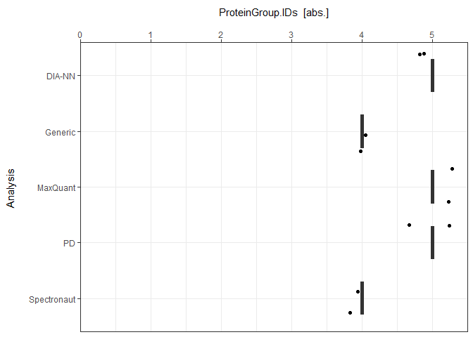
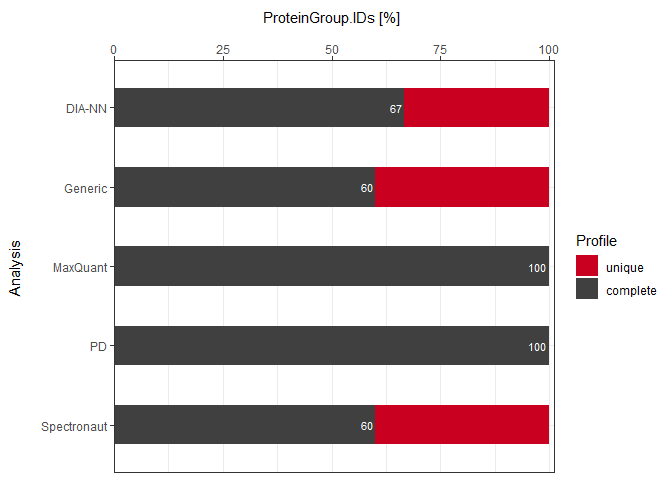

<!-- README.md is generated from README.Rmd. Please edit that file -->

# mpwR 

<!-- badges: start -->

[](https://github.com/OKdll/mpwR/actions)
[](https://CRAN.R-project.org/package=mpwR)
<!-- badges: end -->

mpwR \[ɪmˈpaʊə(r)\] offers a systematic approach for comparing proteomic
workflows and empowers the researcher to effortlessly access valuable
information about identifications, data completeness, quantitative
precision, and other performance indicators across an unlimited number
of analyses and multiple software tools. It can be used to analyze
label-free mass spectrometry-based experiments with data-dependent or
data-independent spectral acquisition.

## Applications

The functions of mpwR provide a great foundation to generate customized
reports e.g. with RMarkdown or to build shiny apps/dashboards for
downstream data analysis. An example for a shiny dashboard is available
[here](https://okdll.shinyapps.io/mpwR/).

## Installation

Install the development version from
[GitHub](https://github.com/OKdll/mpwR) using the
[`devtools`](https://github.com/r-lib/devtools) package by using the
following commands:

``` r
# install.packages("devtools") #remove "#" if you do not have devtools package installed yet
devtools::install_github("OKdll/mpwR", dependencies = TRUE) # use dependencies TRUE to install all required packages for mpwR
```

## Preparation

### Requirements

As input the standard outputs of ProteomeDiscoverer, Spectronaut, DIA-NN
or MaxQuant are supported by mpwR. Details about further requirements
are listed in the vignette
[Requirements](https://okdll.github.io/mpwR/articles/Requirements.html).

### Import

Importing the output files from each software can be easily performed
with `prepare_mpwR`. Further details about importing data are
highlighted in the vignette
[Import](https://okdll.github.io/mpwR/articles/Import.html).

``` r
files <- prepare_mpwR(path = "Path_to_Folder_with_files")
```

### Load packages

``` r
library(mpwR)
library(flowTraceR)
library(magrittr) 
library(dplyr)
library(tidyr)
library(stringr)
library(tibble)
library(ggplot2)
```

## Example - Workflow

This is a basic example which shows the downstream analysis for number
of identifications and data completeness. Please check the vignette
[Workflow](https://okdll.github.io/mpwR/articles/Workflow.html) for a
detailed analysis pipeline and more functionalities.

``` r
#get example
files <- create_example()
```

# Number of Identifications

## Report

The number of identifications can be determined with `get_ID_Report`.

``` r
ID_Reports <- get_ID_Report(input_list = files)
```

<p>
 
</p>

For each analysis an ID Report is generated and stored in a list. Each
ID Report entry can be easily accessed:

``` r
ID_Reports[["DIA-NN"]]
#>   Analysis Run ProteinGroup.IDs Protein.IDs Peptide.IDs Precursor.IDs
#> 1   DIA-NN R01                5           5           5             5
#> 2   DIA-NN R02                5           5           5             5
```

<p>
 
</p>

## Plot

### Individual

Each ID Report can be plotted with `plot_ID_barplot` from precursor- to
proteingroup-level. The generated barplots are stored in a list.

``` r
ID_Barplots <- plot_ID_barplot(input_list = ID_Reports, level = "ProteinGroup.IDs")
```

<p>
 
</p>

The individual barplots can be easily accessed:

``` r
ID_Barplots[["DIA-NN"]]
```


<p>
 
</p>

### Summary

As a visual summary a boxplot can be generated with `plot_ID_boxplot`.

``` r
plot_ID_boxplot(input_list = ID_Reports, level = "ProteinGroup.IDs")
```


<p>
 
</p>

# Data Completeness

## Report

Data Completeness can be determined with `get_DC_Report` for absolute
numbers or in percentage.

``` r
DC_Reports <- get_DC_Report(input_list = files, metric = "absolute")
DC_Reports_perc <- get_DC_Report(input_list = files, metric = "percentage")
```

<p>
 
</p>

For each analysis a DC Report is generated and stored in a list. Each DC
Report entry can be easily accessed:

``` r
DC_Reports[["DIA-NN"]]
#>   Analysis Nr.Missing.Values Precursor.IDs Peptide.IDs Protein.IDs
#> 1   DIA-NN                 1             0           0           4
#> 2   DIA-NN                 0             5           5           3
#>   ProteinGroup.IDs  Profile
#> 1                2   unique
#> 2                4 complete
```

<p>
 
</p>

## Plot

### Individual

#### Absolute

Each DC Report can be plotted with `plot_DC_barplot` from precursor- to
proteingroup-level. The generated barplots are stored in a list.

``` r
DC_Barplots <- plot_DC_barplot(input_list = DC_Reports, level = "ProteinGroup.IDs", label = "absolute")
```

<p>
 
</p>

The individual barplots can be easily accessed:

``` r
DC_Barplots[["DIA-NN"]]
```


<p>
 
</p>

#### Percentage

``` r
plot_DC_barplot(input_list = DC_Reports_perc, level = "ProteinGroup.IDs", label = "percentage")[["DIA-NN"]]
```


<p>
 
</p>

### Summary

As a visual summary a stacked barplot can be generated with
`plot_DC_stacked_barplot`.

#### Absolute

``` r
plot_DC_stacked_barplot(input_list = DC_Reports, level = "ProteinGroup.IDs", label = "absolute")
```


<p>
 
</p>

#### Percentage

``` r
plot_DC_stacked_barplot(input_list = DC_Reports_perc, level = "ProteinGroup.IDs", label = "percentage")
```


<p>
 
</p>
